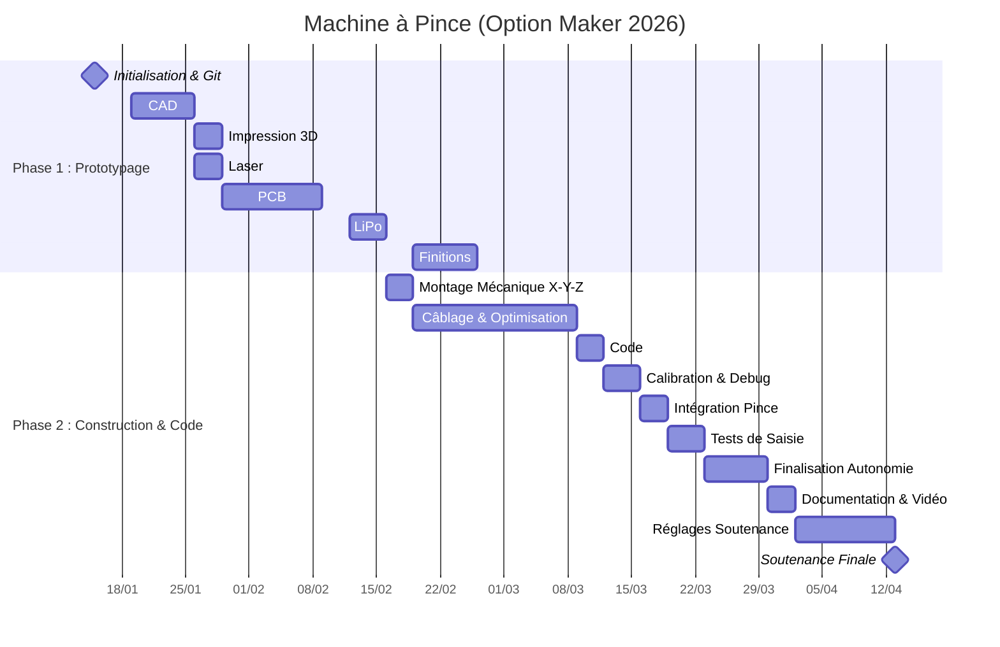

# **2526_Maker_ClawMachine**

##  **Description du Projet**
Dans le cadre de l'**Option Maker 2025-2026** à l'ENSEA, mon projet est de concevoir une machine à pince (Claw Machine) miniature.

L'idée est de concevoir un système automatisé capable de déplacer une pince sur trois axes (X, Y, Z) pour saisir et relâcher des objets.

## **Sommaire**
1. [Principe de réalisation](#1-principe-de-réalisation)
2. [Organisation du dépôt](#2-organisation-du-dépôt)
3. [Rétro-planning](#3-rétro-planning)

## **1. Principe de réalisation**
Pour mener à bien ce projet, j'utiliserais différentes technologies de prototypage rapide qu'on va étudier en cours :

### **1.1 Conception Mécanique & Fabrication**
* **Châssis (LASER) :** Conception d'une structure externe légère et rigide via la découpeuse LASER.
* **Système d'axes (3D Print) :** Déplacement X-Y-Z assuré par des rails et supports modélisés sur mesure et imprimés en 3D.
* **Pince motorisée :** Assemblage de pièces imprimées en 3D actionnées par un servomoteur.

### **1.2 Électronique & Énergie**
* **PCB :** Conception d'un circuit imprimé pour centraliser le contrôle des moteurs, du joystick et du bouton.
* **Alimentation (LiPo) :** Fabrication d'un pack batterie LiPo avec BMS intégré pour assurer la sécurité et l'autonomie du système.

### **1.3 Gestion de projet & Livrables**
* **Versionning (Git) :** Utilisation de Git et GitHub pour le suivi du code source et des fichiers de conception.
* **Documentation :** Reporting continu sur ce README.md et sur la plateforme maker.ensea.fr.
* **Rendu final :** Code source complet, fichiers de fabrication et vidéo de démonstration de 90 secondes.

## **2. Organisation du dépôt**

* **[Project_Management](./Project_Management/)** : Contient le suivi de projet, le journal de bord hebdomadaire, la to do list.
* **[CAD](./CAD)** : Plans de découpe LASER et modèles 3D (pince, supports, rails).
* **[Hardware](./Hardware)** : Schémas électriques, fichiers de routage du PCB et liste des composants (BOM).
* **[Software](./Software)** : Code source pour le pilotage des moteurs et la gestion des entrées utilisateur.
* **[Media](./Media)** : Photos de l'avancement, captures d'écran CAO.

## **3. Rétro-planning**

